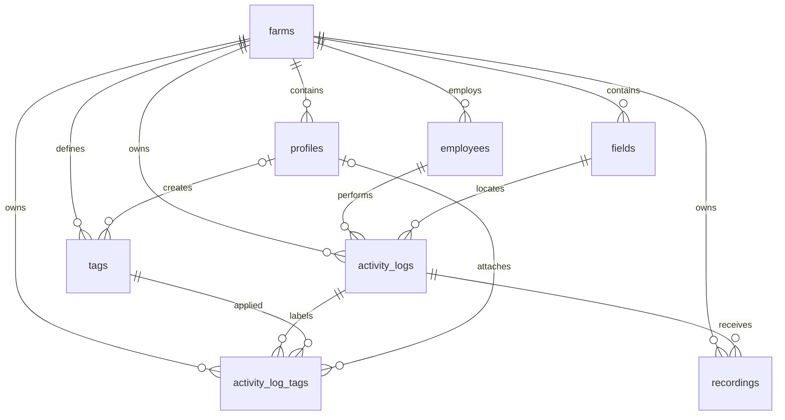

# Local database schema — approval checkpoint

**Subsequent milestone:** farm-level RLS and the profiles → auth.users foreign key are now deployed through migration `20260916010000`. See [current authorization implementation](rls.md). The remainder of this document preserves the original schema-review decisions; references below to deferred RLS/Auth describe that earlier checkpoint. The frontend remains fixture-backed.

Status: user approved the schema and seed, then migration `20260916000000` and `supabase/seed.sql` were applied to the linked `toph-dev-challenge` Supabase project. Remote verification confirmed eight tables, 12 active workers, five recordings, one new recording, four pending logs, and accuracy 90. Local and remote migration history match. Authentication and RLS remain deferred; browser read grants remain withheld. The frontend, fixture query, and DashboardData contract are unchanged. Database storage exists remotely, but the app is not yet connected to it.

## 1. Schema and table responsibilities

All tables use a UUID `id` primary key, generated with `gen_random_uuid()` unless explicitly supplied. All columns are NOT NULL except the nullable columns listed below. Every table has `created_at timestamptz DEFAULT now()`. Mutable entities also have `updated_at timestamptz DEFAULT now()`, maintained by a BEFORE UPDATE trigger. The join table is an attachment event: remove/recreate links rather than maintaining an update timestamp.

| Table | Columns beyond id/timestamps | Why it exists |
|---|---|---|
| farms | name text; timezone text | Tenant and calendar context; a workday and recording day are interpreted in the farm's timezone. |
| profiles | farm_id UUID; full_name text; role text | Application membership and future dashboard-user role. Separate from workers. Auth integration is explicitly deferred. |
| employees | farm_id UUID; full_name text; active boolean | Reusable worker identity and active-worker metric; duplicate names are allowed. |
| fields | farm_id UUID; name text; nullable latitude/longitude double precision | Reusable farm field reference and optional reference point. No invented worker GPS or field polygons. |
| activity_logs | farm_id, employee_id, field_id UUIDs; activity_type text; activity_date date; started_at/ended_at timestamptz; summary text; response_accuracy numeric(5,2); review_status text | Completed work facts and review state, independently of media metadata. |
| recordings | farm_id, activity_log_id UUIDs; recorded_at timestamptz; is_new boolean; nullable storage_bucket/storage_path text and duration_seconds numeric(10,3) | One-to-many media/receipt metadata. Store object keys, not expiring signed URLs or audio bytes. |
| tags | farm_id UUID; name text; nullable created_by UUID | Reusable farm-shared vocabulary such as Needs Review; creator attribution is not ownership. |
| activity_log_tags | farm_id, activity_log_id, tag_id UUIDs; nullable created_by UUID | Many-to-many assignment with its own ID and creation time. |

The exact executable column definitions are in `supabase/migrations/20260916000000_create_dashboard_schema.sql`.

## 2. Relationships



Each user profile belongs to one farm for this challenge. A future multi-farm user would need a membership table, not a comma-separated farm list. Profiles have **no auth.users foreign key yet** and are not seeded. During the Auth phase, provision profiles using actual Auth UUIDs, remove the independent UUID default if appropriate, and add the Auth FK in a new migration after validating existing records. No sign-in code, auth triggers, or synthetic auth users are introduced now.

The `(farm_id, id)` unique constraints on profiles, employees, fields, logs, and tags are deliberate support for composite foreign keys. Every child association checks both the parent ID and the same farm. These are integrity checks, not an authorization substitute; they do not prevent unauthorized same-farm reads or edits.

## 3. Important constraints

- Required identities, names, work dates/times, summary, activity, accuracy, and review state cannot be NULL. Names are bounded and trimmed; summaries must contain content.
- Field and tag names are unique case-insensitively within a farm. Tags also require canonical whitespace and a maximum of 40 characters, matching the current form. Separate farms can use the same names. Employee and farm names are not globally unique.
- The join table forbids duplicate `(farm_id, activity_log_id, tag_id)` assignments.
- Accuracy is 0–100. Coordinates must both be NULL or both present, latitude −90…90 and longitude −180…180; NaN/out-of-range values fail.
- Work end is strictly after start; zero-length work is rejected. Work dates and timestamps must be finite. Overnight work is allowed. There is no false assumption that the receipt date equals the work date or that transcript text is reliable capture metadata.
- Activity values match the existing TypeScript union: Spraying, Harvesting, Planting, Irrigation, Scouting. Review values are pending/reviewed. Text plus CHECK keeps this small vocabulary explicit and migration-editable; adding activities requires a coordinated contract/migration change.
- Roles are admin/manager/member, default member. The column prepares the model; it does not currently enforce permissions.
- Known duration must be positive and within the numeric storage range. Bucket/path must both be NULL or both nonempty. A storage object key is globally unique within its bucket; multiple unavailable recordings may have NULL paths.
- Farm timezones are checked against PostgreSQL's timezone catalog by a write trigger. Cross-table lookups are not hidden inside CHECK constraints.
- No Auth or RLS is implemented. Explicit revocation of default `PUBLIC`, `anon`, and `authenticated` table/function grants prevents accidental API exposure during this incomplete milestone. RLS and intentional API grants require a later migration before public integration; no service key is introduced into the app.

## 4. Indexes tied to query paths

Primary keys and UNIQUE constraints automatically create their indexes. No redundant standalone farm_id indexes are added when an existing composite index begins with farm_id.

| Index/key | Query/use |
|---|---|
| Every UUID primary key | Point lookups and stable entity identity. |
| `(farm_id,id)` unique on profiles/employees/fields/logs/tags | Composite FK targets; farm-scoped lists and joins. Employees' index also narrows active-worker counts to one farm. |
| fields `(farm_id,lower(name))` unique | Field-name lookup and duplicate prevention. |
| tags `(farm_id,lower(name))` unique | Resolve/reuse Needs Review or another normalized tag without duplicates. |
| logs `(farm_id,review_status,activity_date,id)` | Pending logs for a farm and date range, stable chronological ordering. |
| logs `(farm_id,employee_id)` and `(farm_id,field_id)` | Referencing FK checks on parent delete/update; worker/field lookups. |
| recordings `(farm_id,recorded_at)` | Recording and new-recording counts in a farm-local day using timestamp bounds. |
| recordings `(farm_id,activity_log_id,recorded_at DESC,id)` | Load a log's media, choose latest deterministically, and cascade deletion. |
| recordings `(storage_bucket,storage_path)` unique | Prevent the same stored object being attached as multiple records. |
| links `(farm_id,activity_log_id,tag_id)` unique | Load a log's tags, reject duplicate assignment, cascade log deletion. |
| links `(farm_id,tag_id,activity_log_id)` | Reverse lookup for Needs Review filtering; tag deletion. |
| tags/links `(farm_id,created_by)` WHERE creator IS NOT NULL | Clear attribution efficiently when a profile is deleted. |

No full-text/trigram, summary, standalone boolean, or every-column indexes: the current frontend filters the small loaded set. Add search/pagination indexes only once actual server-side query patterns justify their write/storage cost. On tiny seeds, a sequential scan is often the correct planner choice; index existence is not a benchmark claim.

## 5. ON DELETE decisions

| Parent → child | Action | Reason |
|---|---|---|
| Farm → every farm-owned table | RESTRICT | Deleting a tenant must be deliberate, ordered maintenance; it must not silently erase history. |
| Employee → logs | RESTRICT | Deactivate the worker rather than lose work history. |
| Field → logs | RESTRICT | Preserve referenced work locations. Field retirement/archival is future scope. |
| Log → recordings | CASCADE | Recording metadata belongs to the log. Deleting metadata does **not** delete storage bytes; a future deletion workflow must handle object cleanup explicitly. |
| Log → tag assignments | CASCADE | Assignments have no meaning without their log; reusable tag definitions survive. |
| Tag → assignments | CASCADE | Remove obsolete labels without deleting the work records. |
| Profile → created tags/assignments | SET NULL (created_by only) | Preserve shared farm work and vocabulary if a creator leaves; farm_id remains intact. |

UUID relationships use the default ON UPDATE NO ACTION. IDs/farm membership are not casual editable attributes. No delete UI or retention/audit-history subsystem is added.

## 6. Reproducible seed

`supabase/seed.sql` is generated from the **unchanged** `src/lib/demo/fixtures.ts`; `supabase/config.toml` already points at it. Supabase runs seeds after migrations during local initialization/reset. Demo data stays out of the schema migration so it does not silently become production data.

- One Bays Ranch farm, America/Los_Angeles.
- Twelve active employees with existing fixture UUIDs and names.
- Four fields, FIELD A–D, with deterministic UUIDs and unknown coordinates.
- Five logs with the exact fixture IDs, worker associations, dates, times, activities, summaries, accuracy, and review state.
- Five recording metadata rows received April 22, 2026; one new. Storage location and duration stay NULL because no real audio exists yet.
- One reusable Needs Review definition, zero assignments, and zero profiles. The initial screenshot remains untagged.
- All seed IDs and audit timestamps are deterministic. INSERT ON CONFLICT(id) DO NOTHING makes replay non-destructive; replay is not a reconciliation tool for already edited rows. A clean reset reproduces the baseline exactly.

The fifth log is reviewed, explaining five recordings but four pending dashboard rows. Accuracy is the mean over relevant **distinct logs**, not a join-weighted average over recordings. Expected metrics are 5 recordings, 1 new, 12 active employees, 90 accuracy. April 22 is a disclosed snapshot date, not today's date.

## 7. Files and local verification

- `supabase/migrations/20260916000000_create_dashboard_schema.sql`: the only new schema migration; eight tables, constraints, indexes, two trigger functions, timestamp/timezone triggers, withheld API grants.
- `supabase/seed.sql`: generated SQL data, transactionally applied.
- `scripts/generate-database-seed.mjs`: reproducible fixture-to-SQL generation and `--check` drift detection; Node 24 required as in the app.
- `supabase/tests/schema.sql`: transaction-rolled-back assertions for seeds/metrics, invalid data, cross-farm references, uniqueness, delete semantics, timestamps, and grant/RLS stage boundaries.
- `scripts/test-database-local.mjs`: creates a fresh PostgreSQL 17 Docker container without network or published ports, applies migrations, seeds twice, runs assertions, and removes its container. Does not read `.env.local`, Supabase links, or any remote connection URL.

```sh
node scripts/generate-database-seed.mjs --check
node scripts/test-database-local.mjs
npm run check
npm run build
```

SQL validation uses real PostgreSQL 17 with stand-in `anon`/`authenticated` role names. This tests relational behavior, not a complete Supabase Auth/Storage/PostgREST stack. No existing local database was reset. After approval, deployment used `supabase db push --linked --include-seed --skip-vault --yes`. Read-only remote verification is reproducible with `supabase db query --linked --file supabase/tests/verify-deployment.sql`. No Git commit or push was performed.

## 8. Later transition of getDashboardData()

`src/lib/queries/dashboard.ts` still returns fixtures. Configured environment variables do not switch it automatically. Once the next integration milestone is approved:

1. Generate database TypeScript types from the migrated **local** schema. Add a server-only Supabase query adapter; keep components consuming DashboardData.
2. Resolve a trusted farm context (later the verified session/profile). Never choose the farm from an unchecked browser parameter. Do not open anonymous grants merely to get the preview working.
3. Load pending logs joined to employee/field, recordings, and tag assignments/definitions. Order by activity_date then id. Avoid a flat join that duplicates logs across recordings/tags.
4. Map full_name → employee.name; field.name → field; snake_case timestamps → existing camelCase ISO strings; numeric accuracy → number. Location uses the field reference point when present, otherwise NULL, without claiming worker GPS.
5. Select the most recently received recording, tie-breaking by id, for singular recordedAt/audioUrl/isNew. Generate a signed URL only if an actual object exists; unavailable media remains NULL. Multiple recordings are supported by storage, but the current UI intentionally shows one. A log without any recording must produce an explicit mapping/data error under the current required recordedAt contract; support for manually created, recording-free logs would warrant a small nullable contract change later, not an invented date.
6. Flatten assignments into LogTag. Prefer assignment.id and assignment.created_at for stable attachment identity. `ownerUserId` is a legacy misnomer: make it nullable (or rename to createdBy in a narrow coordinated change) for system/deleted creators. Never use an empty/fake UUID or infer ownership permissions from it. No visual changes are necessary.
7. Query metrics independently of the pending table filter: active employees, all recordings in the chosen day, new recordings in that day, and distinct associated logs' average accuracy. Compute start/end midnights in the farm timezone separately (DST-safe), then use half-open recorded_at timestamp bounds so the recording index can be used. Do not multiply accuracy or recording counts by the tag join.
8. Return source: supabase only after real successful reads. Propagate errors to an explicit error state, without fallback fixtures. Keep the approved snapshot date configurable; later live mode can use the actual farm-local day.

## 9. Interview decisions and limits

- Normalize entities with independent identity/lifecycle, not every scalar into a lookup table. Employees, fields, media, and reusable tags justify tables; five activity strings do not yet justify another table.
- A farm_id repeated on children is intentional redundancy enforced by composite keys: it makes tenant queries straightforward and impossible cross-farm references rejectable even before RLS. It is not itself access control.
- Separate worker identity from signed-in manager identity. Seed no fake users just to populate an empty profiles table.
- Preserve calendar work dates separately from UTC instants and upload/receipt timestamps. Offline receipt may be days after work, and the supplied transcript has a different spoken timestamp.
- Preserve unavailable media as NULL, not a fabricated URL/duration or screenshot-derived coordinates.
- A review-status field and Needs Review tag have different meanings: pending/reviewed determines the current work queue; Needs Review is a reusable attention label. No synchronization rule or review state machine is invented.
- Referential constraints prevent invalid data; RLS will authorize access; application validation gives usable error messages. Each has a different responsibility.
- Triggers maintain updated_at but are not an audit trail. Names/field reference points are current normalized values, not historical snapshots; versioned names/geometry and audit retention are future domain decisions.
- Keep seed data separate from DDL, and derive it from fixtures to prevent parallel hardcoded datasets drifting.

## 10. Approval boundary and sources

The original pre-push checkpoint was honored. After the user approved, the reviewed migration and seed were pushed and verified. Auth/RLS is not finished; public integration still needs the separately scoped authorization milestone.

References used for implementation decisions:

- [Supabase database migrations](https://supabase.com/docs/guides/local-development/database-migrations): repository migration workflow.
- [Supabase seeding](https://supabase.com/docs/guides/local-development/seeding-your-database): separate seed files run after migrations on local initialization/reset.
- [PostgreSQL 17 constraints](https://www.postgresql.org/docs/17/ddl-constraints.html): composite references, NULL-aware checks, unique indexes, FK indexing, and column-specific SET NULL.
