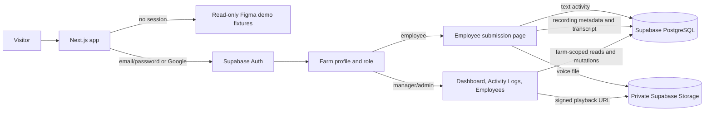
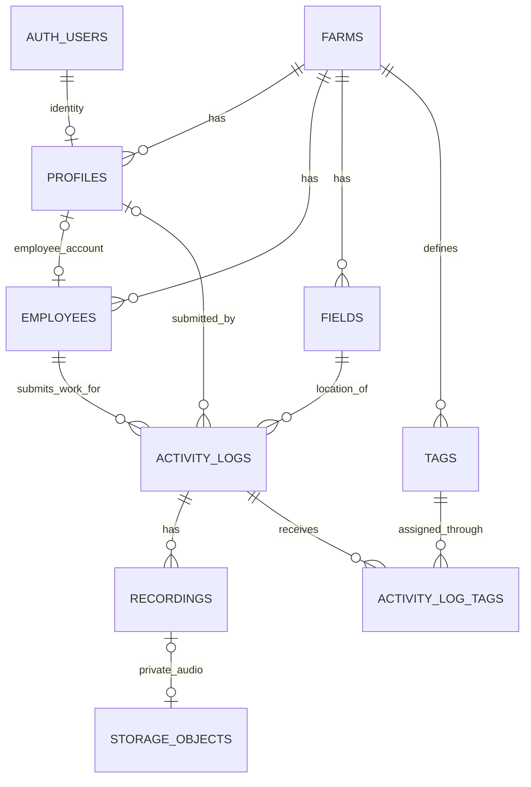
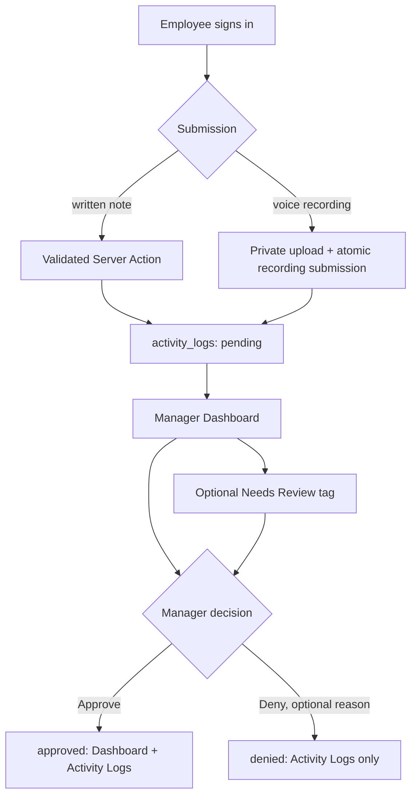

# Toph — current implementation schematic

Updated September 17, 2026. This describes the implemented application and linked Supabase schema, rather than an earlier build proposal.

## System overview

The public `/` route opens the guest manager preview when no one is signed in. Guest data is local, disclosed demo data; it is not a public connection to the farm database. A signed-in employee goes to `/employee`. A signed-in manager or admin sees their farm's live data. Database failures show an error instead of silently switching to fixtures.

## Database relationships

All eight application tables use UUID primary keys. `auth.users` is managed by Supabase Auth, and `storage.objects` holds private audio files.

| Table | What it holds | Important links and behavior |
| --- | --- | --- |
| `farms` | Farm name and timezone. | Tenant root; referenced by farm-scoped records. |
| `profiles` | Auth user's name, farm, role (`admin`, `manager`, `member`, or `employee`), and optional employee link. | `id` references `auth.users.id`; each profile belongs to one farm. Employee roles require an employee link. |
| `employees` | Worker name, active flag, and optional contact email. | Belongs to a farm; may exist without a login, as the Figma seed workers do. |
| `fields` | Reusable field name and optional coordinates. | Belongs to a farm; log references must use a field from the same farm. |
| `activity_logs` | Work date/time, employee, field, activity type, summary, optional transcript/note, response accuracy, review status, optional denial reason, and submitter. | Core persistent work record. Same-farm composite foreign keys link employee, field, and submitter. |
| `recordings` | Audio metadata, capture time, duration, and optional private Storage path. | Belongs to a log; deleting the log cascades to recording metadata. Seed recordings have no audio file. |
| `tags` | Reusable farm tag names such as `Needs Review`. | Unique within a farm without regard to case. Tag creator attribution is optional. |
| `activity_log_tags` | Links a log to a tag. | Unique per farm/log/tag; deleting a log or tag removes its links. |

Farm IDs are repeated on dependent rows so composite foreign keys can reject cross-farm links. Farm-level row-level security (RLS) also limits reads and writes. Employee and field deletion is restricted while logs reference them. Seed logs have no `submitted_by` account and are protected from manager deletion; manager deletion is allowed only for employee-submitted logs.

## Roles and access

| Visitor or role | Current access |
| --- | --- |
| Guest manager | Read-only local Figma Dashboard, Activity Logs, and sample Employees. No private contacts, database writes, approval, or denial. |
| Employee | Create an account, sign in, view their own submission page, and submit written or voice activity to their linked farm/employee record. Cannot decide review status. |
| Manager / admin | Read the farm Dashboard, full Activity Logs, and employee directory; add/remove tags; approve or deny pending logs; edit contact email; delete eligible employee submissions. |
| Member | No manager dashboard access or manager mutation rights. |

Email/password and Google sign-in use Supabase Auth. The server resolves the verified identity to a `profiles` row; neither the browser nor signup metadata may choose a manager role or another farm. Server actions validate access, and database grants plus RLS enforce the same boundary. The app does not send a service-role key to the browser.

## Submission and review flow

`pending → approved` and `pending → denied` are the only review transitions. The optional denial reason is limited to 200 characters. Final decisions cannot be changed back through the current workflow. Denial keeps the record; deletion removes an eligible employee submission. Tags remain independent of status and survive either decision.

For voice submissions, the browser captures up to 90 seconds of audio. Browser speech recognition can fill an editable transcript when available; a typed transcript or note remains possible. The audio file goes to the private `toph-recordings` bucket, while its log and recording metadata are stored in PostgreSQL. Manager playback uses a short-lived signed URL.

## Views and numbers

| View or metric | Current rule |
| --- | --- |
| Guest Dashboard | Original four pending Figma rows; disclosed April 22, 2026 snapshot values `5 / 12 / 90`. |
| Signed-in Dashboard | Pending and approved logs from the manager's farm; denied logs excluded. `This Month` uses the farm's actual current month. |
| Activity Logs | Full same-farm history: pending, approved, and denied, with status filtering and expandable details. |
| Today's Recordings | Count of employee activities submitted on the farm's current local date, including text-only submissions; review decisions do not change this count, deletion does. |
| Active Workers | Four named Figma baseline workers plus active employees linked to created employee accounts. |
| Response Accuracy | Rounded mean of scored April snapshot logs; new unscored employee submissions do not fabricate a score. |

The UI-facing `DashboardData` shape lives in [`src/types/dashboard.ts`](../src/types/dashboard.ts). The server-only adapter in [`src/lib/queries/dashboard.ts`](../src/lib/queries/dashboard.ts) reads normalized Supabase tables and produces that shape. The guest path uses local fixtures through the same boundary. The version-controlled database source is [`supabase/migrations/`](../supabase/migrations/), with reproducible demo records in [`supabase/seed.sql`](../supabase/seed.sql).

## Current limits and delivery state

The map is a labeled design preview, not a live field-location map. Original Figma seed recordings have no playable audio file; newly submitted employee recordings do. Speech recognition depends on browser support and is not a server transcription service. The application has passed local database/RLS tests, 33 browser tests, lint/type checking, a production build, and a linked-project review smoke check. The approval/denial migration is applied to the linked Supabase project. No Git push or Vercel deployment has been performed for this milestone.
